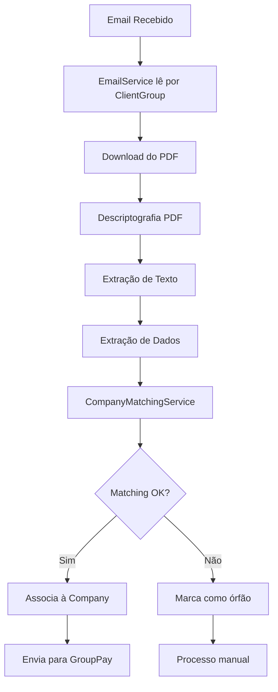

# 📧 Consolidação de Emails por Administradora (ClientGroup)

## 📋 Resumo da Mudança

Esta atualização implementa a **consolidação de emails por administradora**, mudando o modelo atual onde cada condomínio (Company) possui seu próprio email, para um modelo onde uma administradora (ClientGroup) centraliza o recebimento de emails de todos os seus condomínios.

### 🔄 Antes vs Depois

**ANTES:**
```
Administradora A:
├── condominio1@empresa.com (Company 1)
├── condominio2@empresa.com (Company 2)
└── condominio3@empresa.com (Company 3)
```

**DEPOIS:**
```
Administradora A:
└── administradoraA@empresa.com (ClientGroup)
    ├── Condomínio 1 (Company 1) - identificado via CNPJ/Nome
    ├── Condomínio 2 (Company 2) - identificado via CNPJ/Nome
    └── Condomínio 3 (Company 3) - identificado via CNPJ/Nome
```

## 🏗️ Arquitetura da Solução

### Novo Fluxo de Processamento



### 🔧 Componentes Modificados

| Componente | Tipo de Alteração | Descrição |
|------------|-------------------|-----------|
| `ClientGroup` | **Entidade** | Adicionados campos de email e controle |
| `Company` | **Entidade** | Removidos campos de email, adicionados campos de identificação |
| `Document` | **Entidade** | Adicionada referência ao ClientGroup |
| `EmailService` | **Serviço** | Refatorado para trabalhar com ClientGroup |
| `CompanyMatchingService` | **Novo Serviço** | Identifica Company baseado no conteúdo do documento |
| `EmailProcessJob` | **Job** | Atualizado para processar ClientGroups |
| `CompanyMatchingJob` | **Novo Job** | Job para matching de documentos |

## 🗄️ Alterações no Banco de Dados

### Novos Campos

#### Tabela `tb_client_group`
```sql
ALTER TABLE tb_client_group 
ADD COLUMN email VARCHAR(255) UNIQUE,
ADD COLUMN password VARCHAR(255),
ADD COLUMN last_mail_read TIMESTAMP,
ADD COLUMN status VARCHAR(50) DEFAULT 'NOT_PROCESSING';
```

#### Tabela `tb_company`
```sql
ALTER TABLE tb_company 
ADD COLUMN nome_fantasia VARCHAR(255),
ADD COLUMN razao_social VARCHAR(255);

-- Campos removidos (fazer backup antes):
-- email, password, last_mail_read, email_status
```

#### Tabela `tb_document`
```sql
ALTER TABLE tb_document 
ADD COLUMN client_group_id BIGINT,
ADD CONSTRAINT fk_document_client_group 
    FOREIGN KEY (client_group_id) REFERENCES tb_client_group(id);
```

### Novos Enums

#### `DocumentStage`
```java
public enum DocumentStage {
    DOWNLOADED,
    PASSWORD_REMOVED,
    TEXT_EXTRACTED,
    EXPENSE_EXTRACTED,
    COMPANY_MATCHED,        // 🆕 Novo
    COMPANY_NOT_FOUND,      // 🆕 Novo
    SENT_TO_GROUP_PAY,
    SENT_TO_S3,
    DELETE_FROM_LOCAL
}
```

## 🆕 Novos Serviços

### CompanyMatchingService

**Responsabilidade:** Identificar qual Company (condomínio) um documento pertence baseado no conteúdo extraído.

**Estratégias de Matching:**
1. **CNPJ Exato** - Prioridade máxima
2. **Nome Fantasia** - Match exato normalizado
3. **Razão Social** - Match exato normalizado
4. **Fuzzy Matching** - Similaridade de texto para casos com pequenas diferenças

**Normalização de Dados:**
- Remove acentos e caracteres especiais
- Converte para minúsculas
- Remove espaços extras
- Para CNPJ: mantém apenas números

**Exemplo de Uso:**
```java
@Autowired
private CompanyMatchingService companyMatchingService;

// Executado automaticamente pelo CompanyMatchingJob
companyMatchingService.matchDocumentToCompany(document);
```

## 🔄 Jobs Atualizados

### 1. EmailProcessJob
- **Antes:** Processava `Company` individualmente
- **Depois:** Processa `ClientGroup` e seus emails

### 2. CompanyMatchingJob (Novo)
- **Execução:** Após `ExtractorExpenseJob`
- **Função:** Identifica a Company correta para cada documento
- **Configuração:** `@Scheduled` configurável

### 3. Ordem de Execução dos Jobs
```
1. EmailProcessJob (busca emails por ClientGroup)
2. DecryptPdfJob (remove senhas dos PDFs)
3. ExtractorTextJob (extrai texto dos PDFs)
4. ExtractorExpenseJob (converte texto em dados estruturados)
5. CompanyMatchingJob (🆕 identifica a Company)
6. ExpenseSenderJob (envia para GroupPay)
```

## 📝 Guia de Migração

### Pré-Requisitos
- [ ] Backup completo do banco de dados
- [ ] Ambiente de teste configurado
- [ ] Validação das estruturas das classes `Expense*`

### Passo a Passo

#### 1. Preparação do Banco de Dados
```bash
# 1. Fazer backup
mysqldump -u user -p database > backup_antes_migracao.sql

# 2. Executar scripts de alteração
mysql -u user -p database < scripts/001_add_clientgroup_fields.sql
mysql -u user -p database < scripts/002_add_company_fields.sql
mysql -u user -p database < scripts/003_add_document_clientgroup.sql
mysql -u user -p database < scripts/004_migrate_data.sql
mysql -u user -p database < scripts/005_create_indexes.sql
```

#### 2. Atualização do Código
```bash
# 1. Atualizar entidades
cp entities/* src/main/java/domain/entity/

# 2. Adicionar novo serviço
cp CompanyMatchingServiceImpl.java src/main/java/service/impl/

# 3. Atualizar serviços existentes
cp EmailServiceImpl.java src/main/java/service/impl/
cp DocumentServiceImpl.java src/main/java/service/impl/

# 4. Atualizar jobs
cp jobs/* src/main/java/job/
```

#### 3. Configuração dos Jobs
```properties
# application.properties
company-matching.cron=0 */5 * * * ?  # A cada 5 minutos
company-matching.enabled=true
company-matching.retry-delay=10      # minutos
```

#### 4. Implementação dos Métodos de Extração

**⚠️ IMPORTANTE:** Complete os métodos `TODO` no `CompanyMatchingServiceImpl`:

```java
// Exemplo para ExpenseNF
private String getCnpjFromExpenseNF(ExpenseNF nfe) {
    if (nfe.getDestinatario() != null) {
        return nfe.getDestinatario().getCnpj();
    }
    return null;
}

private String getNomeFromExpenseNF(ExpenseNF nfe) {
    if (nfe.getDestinatario() != null) {
        return nfe.getDestinatario().getNome();
    }
    return null;
}
```

## 🔍 Monitoramento e Troubleshooting

### Logs Importantes

#### Matching Bem-Sucedido
```
INFO  - ✅ Documento invoice123.pdf associado à company: Condomínio ABC (CNPJ: 12345678000190)
```

#### Matching Falhado
```
WARN  - ❌ Não foi possível associar documento invoice123.pdf a nenhuma company do ClientGroup uuid-123
DEBUG - Companies disponíveis para matching:
DEBUG -   - CNPJ: 11111111000111, Nome Fantasia: Condomínio A, Razão Social: Condomínio A LTDA
DEBUG -   - CNPJ: 22222222000222, Nome Fantasia: Condomínio B, Razão Social: Condomínio B LTDA
```

### Queries de Monitoramento

#### Documentos Órfãos (sem Company)
```sql
SELECT d.id, d.file_name, d.stage, cg.uuid as client_group_uuid
FROM tb_document d
JOIN tb_client_group cg ON d.client_group_id = cg.id
WHERE d.company_id IS NULL 
  AND d.stage = 'COMPANY_NOT_FOUND'
ORDER BY d.created_at DESC;
```

#### Taxa de Sucesso do Matching
```sql
SELECT 
    cg.uuid,
    COUNT(*) as total_documents,
    SUM(CASE WHEN d.company_id IS NOT NULL THEN 1 ELSE 0 END) as matched_documents,
    ROUND(
        (SUM(CASE WHEN d.company_id IS NOT NULL THEN 1 ELSE 0 END) * 100.0) / COUNT(*), 
        2
    ) as success_rate_percent
FROM tb_document d
JOIN tb_client_group cg ON d.client_group_id = cg.id
WHERE d.stage IN ('COMPANY_MATCHED', 'COMPANY_NOT_FOUND')
  AND d.created_at >= DATE_SUB(NOW(), INTERVAL 7 DAY)
GROUP BY cg.uuid
ORDER BY success_rate_percent DESC;
```

### Dashboard de Métricas

#### Métricas Recomendadas
- **Taxa de matching por ClientGroup**
- **Documentos órfãos por dia**
- **Tempo médio de processamento**
- **Tipos de documento mais problemáticos**

## ⚠️ Pontos de Atenção

### Performance
- **Matching pode ser custoso:** O algoritmo de matching executa para cada documento
- **Solução:** Cache das Companies por ClientGroup
- **Monitoramento:** Alertas se o job demorar mais que X minutos

### Qualidade dos Dados
- **CNPJs inconsistentes:** Diferentes formatos (com/sem formatação)
- **Nomes similares:** "Condomínio ABC" vs "Cond. ABC"
- **Solução:** Normalização robusta e matching fuzzy

### Casos Edge
1. **Documento sem CNPJ nem nome identificável**
2. **Multiple matches** (mesmo CNPJ para múltiplas Companies)
3. **Documentos de terceiros** (não relacionados ao condomínio)

## 🚀 Próximos Passos

### Fase 1 - Implementação Básica ✅
- [x] Alterações no banco de dados
- [x] Atualização das entidades
- [x] CompanyMatchingService básico
- [x] Jobs atualizados

## 🆘 Suporte

### Logs de Debug
Para ativar logs detalhados:
```properties
logging.level.br.com.groupsoftware.grouppay.extratoremail.service.impl.CompanyMatchingServiceImpl=DEBUG
```

### Rollback de Emergência
```sql
-- Reverter documents para Company original
UPDATE tb_document d 
SET company_id = (
    SELECT c.id 
    FROM tb_company c 
    WHERE c.client_group_id = d.client_group_id 
    LIMIT 1
)
WHERE d.company_id IS NULL;
```
